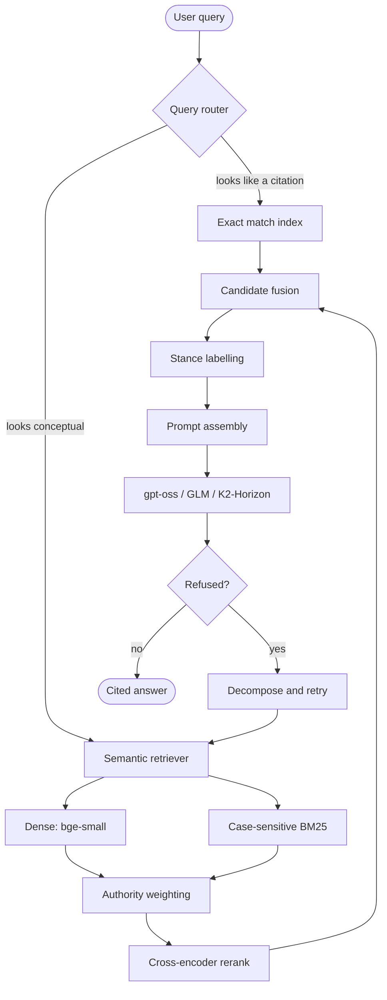

# Ratio

[](https://github.com/rasinmuhammed/rag-from-scratch/actions/workflows/test.yml)

A retrieval-augmented generation engine for Indian court judgments, built from scratch (no LangChain, no LlamaIndex) so that every retrieval and generation decision could actually be measured instead of assumed.

The name comes from *ratio decidendi*, the part of a judgment that is the actual binding precedent, as opposed to *obiter* (things said in passing) or a party's own submissions. That distinction is the whole point of this project: a judgment records what counsel argued, what a lower court found, and what the court itself finally held, often in the same paragraph, and most of what people call "legal RAG" doesn't bother separating those before handing them to a language model.

Still actively being worked on. The retrieval pipeline and the measurement discipline behind it are the solid part; the frontend and the full-corpus index are still catching up.

## The dataset

10,588 Indian court judgments (Supreme Court, High Courts, and a handful of tribunals), pulled from the [OpenNyAI InJudgements dataset](https://huggingface.co/datasets/opennyaiorg/InJudgements_dataset) on Hugging Face. The raw dump has 11,970 rows that deduplicate down to those 10,588, which chunk out to 414,122 pieces once indexed.

## What's actually measured

Every number here comes from running `scripts/evaluate.py` against a 313-query set I labelled by hand (288 exact-citation queries, 25 conceptual ones). The full writeup, including the things that didn't work, is in [`retrieval_notes.md`](retrieval_notes.md), which is honestly the part of this repo I'd point someone to first.

| config | exact recall | exact precision | exact MRR |
|---|---|---|---|
| dense only | 0.040 | 0.033 | 0.099 |
| BM25 only | 0.586 | 0.440 | 0.760 |
| reranked (cross-encoder) | 0.730 | 0.565 | 0.896 |
| routed (exact index + semantic backfill) | 0.892 | 0.710 | 1.000 |

The biggest single win here is routing, not ranking. A query like `AIR 1974 Patna 164` isn't a ranking problem, it's a lookup wearing a ranking problem's clothes: dense embeddings collapse "AIR 1974" and "AIR 2004" into roughly the same vector, and even hybrid fusion (BM25 + dense, reciprocal rank fusion) scores *below* plain BM25 on these queries, because averaging two systems that are both confused about an identifier just gives you a confused average. So identifier-shaped queries skip the rankers entirely and go to an exact-match index instead. That decision, and the numbers that justify it, are in [`route.py`](src/rag/route.py).

On the generation side, forcing the model to answer in a JSON schema with a required citation field on every claim (instead of just asking it nicely to cite things) took citation precision from 85% to 91.2%, support from 88.7% to 96.9%, and uncited claims to a flat 0%, measured on a 15-query benchmark. That last number is a structural guarantee, not luck: the schema makes it impossible to emit a claim with no source attached. It does not make the citation *correct*, and about 40% of conceptual queries in that same benchmark still refuse to answer rather than guess. Both of those are recorded, not smoothed over.

## How it's put together

**The router** looks at a query before anything else touches it. If it contains something that looks like a citation, a section number, or a case number, it goes straight to an exact-match index built at indexing time. Everything else goes to the semantic path. This exists because of the measurement above, not the other way around.

**Retrieval on the semantic path** is BM25 plus a dense bi-encoder (`bge-small-en-v1.5`, chosen after it beat `voyage-law-2`, a model actually trained for legal text, on this corpus), fused with reciprocal rank fusion and then reordered by a cross-encoder. The cross-encoder reranker (`bge-reranker-base`) was also tested against a larger BGE model and a much smaller MiniLM cross-encoder; base won both times, which is written up in the notes.

**Every retrieved passage gets a stance label** before it reaches the model: is this the court's own holding, a party's submission, both, or neither. Judgments genuinely do record "counsel argued X" right next to "the court finds Y," and without this label a model will happily cite the losing side's argument as if it were the ruling. This is a prompted mitigation, not a hard guarantee the way the citation schema is, and I've tried to be careful about that distinction throughout.

**Court hierarchy and citation count** feed into re-ranking as a deterministic multiplier, so a Supreme Court judgment doesn't lose to a semantically-similar but non-binding tribunal order. This hasn't been isolated in its own evaluation run yet; it's a reasonable idea implemented, not yet a measured one.

**If the first pass refuses to answer**, a corrective step decomposes the query into sub-questions, retrieves for each independently, and tries again with the combined context. Also not yet measured for how often it turns a refusal into a right answer versus a confidently wrong one, which is exactly the kind of thing this project tries not to claim without checking.

Every chunk also carries a short machine-generated summary of its parent judgment stapled to the front of it, so a clause that reads well on its own doesn't get pulled out of a completely unrelated case. The 450-token chunk size that summary sits inside of was picked for a reasonable, stated reason and has not itself been swept against the label set, which is worth saying plainly rather than implying it's optimal.



## Running it

```bash
uv sync

# pull the corpus and build the index (a few hours, ~1.2GB)
uv run python scripts/download_corpus.py
uv run python scripts/build_index.py --out data/index-full --summarise

# ask something
export GROQ_API_KEY=...   # or LLM_PROVIDER=ifm / mercury / tokenrouter
uv run python scripts/ask.py "grounds for granting a temporary injunction"
uv run python scripts/ask.py            # interactive, if you're going to ask more than one thing
```

Startup loads all 414,122 chunks, their embeddings, and the BM25 postings into memory, which takes about 85 seconds. Running `ask.py` without a query keeps the process alive so you only pay that cost once.

One honest caveat: the FastAPI server (`src/rag/api.py`) currently defaults to a smaller 6,476-chunk index rather than the full one, while I rebuild the full index's payload file. `scripts/ask.py` already uses the full index. Override with `RATIO_INDEX_DIR` if you need to point either one somewhere else.

Tests: `uv run python -m pytest tests/`

The web UI is a Next.js app in `frontend/` that talks to the API server:

```bash
uv run uvicorn rag.api:app --reload   # terminal 1
cd frontend && npm install && npm run dev   # terminal 2
```

## Deploying

`.env.example` lists every environment variable the API server actually reads. The two that matter for a deploy target rather than local development:

- `RATIO_INDEX_REPO`, a Hugging Face Hub dataset repo the server pulls the index from at startup if it isn't already on disk (`data/` is gitignored, so a fresh container starts with no index otherwise). Push one with `scripts/upload_index_to_hf.py`.
- `RATIO_ALLOWED_ORIGINS`, the real frontend origin once you have one, instead of the wildcard CORS default that's fine for local development.

`GET /health` returns `{"status": "ok", "chunks_indexed": N}` for whatever's hosting this to check the process is actually up. `/query`, `/stream` and `/agent_stream` are all rate-limited (20 requests per 5 minutes, shared, since they all draw from the same LLM provider quota), since a public link calling a paid API with no limit is a real cost, not a hypothetical one.

## Where to start reading

Roughly in dependency order:

| | |
|---|---|
| [`chunk.py`](src/rag/chunk.py) | Boundary detection and the summary-prefix injection. |
| [`embed.py`](src/rag/embed.py) | Sharded index writes, vectors normalised at write time. |
| [`retrieve.py`](src/rag/retrieve.py) | Dense retrieval. |
| [`keyword.py`](src/rag/keyword.py) | Case-sensitive BM25, `array.array` postings to keep memory sane at this scale. |
| [`hybrid.py`](src/rag/hybrid.py) | Reciprocal rank fusion of the two. |
| [`route.py`](src/rag/route.py) | The exact-match router, and the reasoning behind it. |
| [`stance.py`](src/rag/stance.py) | Holding vs. submission classification. |
| [`corrective.py`](src/rag/corrective.py) | Query decomposition when the first pass refuses. |
| [`generate.py`](src/rag/generate.py) | Prompt assembly, the citation schema, refusal handling. |
| [`cache.py`](src/rag/cache.py) | A semantic cache that deliberately does *not* trust embedding similarity for identifier queries, for the same reason the router doesn't. |
| [`evaluate.py`](src/rag/evaluate.py) | The recall/precision/MRR harness everything above is scored with. |

Embeddings are `BAAI/bge-small-en-v1.5`. Generation goes through whichever provider `LLM_PROVIDER` points at (Groq's `gpt-oss-120b` by default, or Mercury 2, TokenRouter's GLM, and `K2-Horizon-375B-A23B`, a mixture-of-experts model with about 23B parameters active at a time despite the 375B total), so swapping models for a comparison is an environment variable, not an edit someone forgets to revert.

## License

MIT, see [`LICENSE`](LICENSE).
